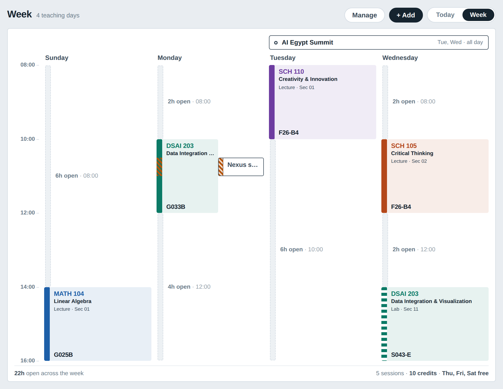
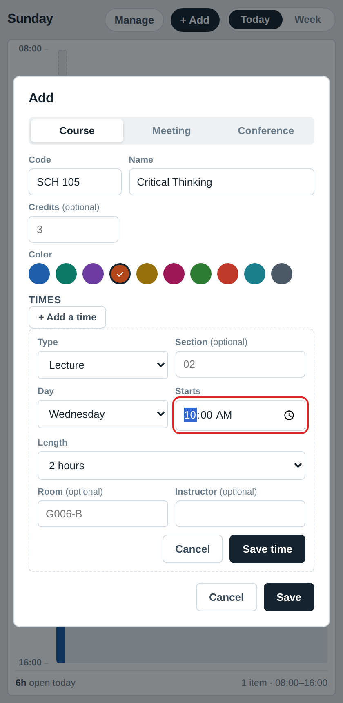
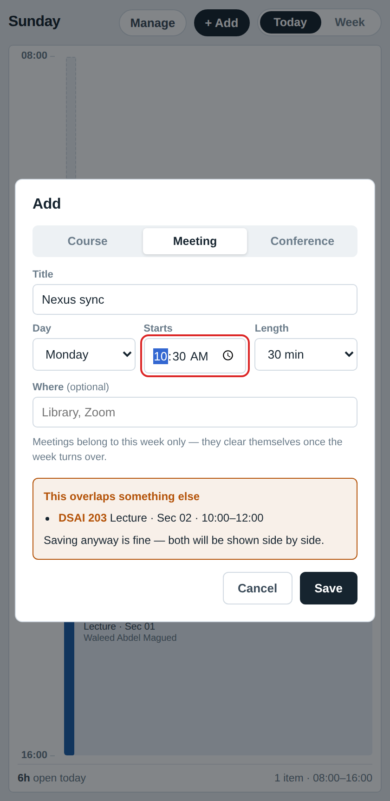
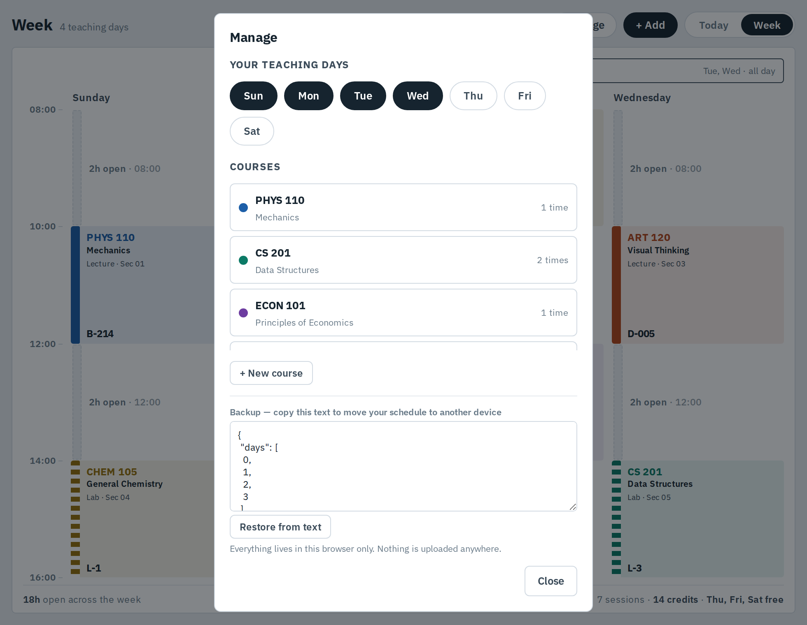

# Day Spine

A weekly timetable that treats **time as the layout** — not a grid of boxes you
fill in. Free time is drawn as its own real, measured shape. A lecture and a
personal meeting can occupy the same hour without either one hiding the
other. And the one thing you actually need mid-walk-to-class — the room — is
never the thing that gets cut off.

No sign-up, no server, no tracking. It's one HTML file that runs entirely in
your browser. Open the link, add your courses, and it's yours.

**[→ Open the app](https://omar-issam-abdelhalim.github.io/day-spine/)** &nbsp;·&nbsp; see [Getting started](#getting-started) below for how to use it and keep it
---

## Why this exists

Every calendar app answers "what's on my schedule." Almost none of them
answer the question you actually ask while standing in a hallway: *am I
supposed to be somewhere right now, and if not, how long do I actually have?*

Day Spine is built around three ideas that most calendars skip:

- **Free time is a first-class thing**, drawn at its real size — not the
  absence of a box, but a shape you can see and plan around.
- **A fixed commitment and a personal one look different on purpose.**
  Your courses are solid blocks of color. A meeting you scheduled yourself is
  an outline — because it's negotiable, and a lecture isn't.
- **A conflict is never hidden.** If a meeting overlaps a lecture, both stay
  fully visible, split to share the hour, with a small marker over exactly
  the minutes that clash. You decide what to do about it — the app just
  refuses to lie to you about what's true.

## What it looks like

**A week, at a glance.** Courses in solid color, a lab shown with a dashed
edge, a personal meeting as an outline overlapping a lecture (both visible,
the overlap marked), a conference as a banner above the days it spans, and
every gap labelled with how long it actually is.



**Adding a course takes three fields.** Code, name, one time. Everything
else — room, instructor, section, a color of your choosing — is optional.



**Conflicts are named, not hidden.** Adding something that overlaps a course
tells you exactly what it collides with, and lets you save it anyway.



**Manage everything from one place** — your teaching days, every course, and
a plain-text backup you can copy to another device.



---

## Getting started

The first time you open it, it asks two questions and then gets out of your way:

1. **Which days do you have classes?** This sets your columns — Sunday
   through Wednesday, Monday through Friday, whatever your week looks like.
2. **Add your first course.** Just a code and a name and one time slot.

That's it. No account, no import wizard.

### Adding a course
- **Required:** a code (`MATH 104`), a name (`Linear Algebra`), and one time
  (a day, a start time, a length).
- **Optional:** type — Lecture, Lab, Tutorial, Section, or your own label —
  section number, room, instructor, and credits.
- **Color** is picked for you from a palette when you add a course, and you
  can override it. Give two related things (a lecture and its lab, say) the
  same color on purpose if that helps you read your week.
- A course can have more than one time. Add the lecture now; when you
  register for the tutorial next week, open the course again and add it —
  "+ Add a time" inside the course editor.

### Adding a meeting or a conference
- **Meeting** — a one-off, this-week-only commitment: a sync, an office
  hour, a call. Pick a day, a start time, a length.
- **Conference** — something that takes over one or more whole days rather
  than a time slot. It's drawn as a banner above the axis, and the courses
  underneath stay fully visible.
- Both meetings and conferences **clear themselves automatically** once the
  week they were added in ends. They're for this week's plan, not a
  permanent fixture.

### Today vs. Week
**Today** shows one day, full size, with a live layer: the portion of a
class that's already happened quietly empties out of its own card, and the
time remaining in whatever's happening right now is shown next to the room.
**Week** shows every teaching day side by side, for planning ahead.

### Your data
Everything — your days, your courses, your meetings — lives in
**your browser's local storage only.** Nothing is sent anywhere, nothing
needs an account. That also means it doesn't automatically follow you to
another device or browser. Use **Manage → Backup** to copy a text block you
can paste back in anywhere else you open the app.

---

## Running it yourself

It's a single self-contained HTML file. Any of these work:

- **Just open it.** Download `index.html` and double-click it. Everything
  works except the Google-hosted font, which falls back to your system font.
- **Host it anywhere static.** Drop it on GitHub Pages, Netlify, Vercel, or
  any web server — it needs nothing else.
- **Add it to your phone's home screen.** Open the hosted link in Chrome or
  Safari, then use "Add to Home Screen" for something that opens like an app.

### Publishing your own copy on GitHub Pages
```
git clone <this-repo-url>
cd day-spine
git checkout -b my-schedule   # optional, if you plan to customize it
```
Then in the repo's **Settings → Pages**, set the source to the `main` branch
and the `/docs` folder, save, and GitHub gives you a live link in a minute or
two.

---

## Design notes, if you're curious

A few decisions that shape how it behaves, in case you're extending it:

- **The time axis stretches to fit what you schedule.** Add a course at
  7 a.m. or a meeting at 9 p.m. and the board grows to include it — every
  day is drawn against the same range, so comparing days stays honest.
- **Overlaps split the lane, proportionally, only for the contested
  minutes.** A fixed course session gets more of the width than a personal
  event sharing its slot, since the course is the one that can't move.
- **Colors are stored as a palette index, not a hex code**, so light and
  dark mode each get an appropriately tuned version of the same color
  automatically.
- **Removing a teaching day never deletes anything.** It just stops
  rendering that day's sessions — add the day back and they reappear
  exactly as they were.

## License

MIT — see [LICENSE](LICENSE). Use it, fork it, change the colors, put your
own name on it.
